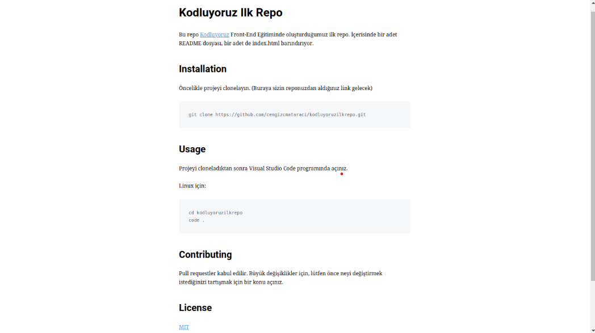

# Kodluyoruz İlk Repo

Bu repo [Kodluyoruz](kodluyoruz.org) Front-End Eğitiminde oluşturduğumuz ilk repo. İçerisinde bir adet README dosyası, bir adet de index.html barındırıyor.



## Installation

Öncelikle projeyi clonelayın. (https://github.com/Kadirmhz/kodluyoruzilkrepo.git)

```bash
git clone https://github.com/Kadirmhz/kodluyoruzilkrepo.git
```

## Usage 

Projeyi clonedıktan sonra Visual Studio Code programında açınız.

Linux için:
```linux
cd kodluyoruzilkrepo
code .
```

## Contributing
Pullrequestler kabul edilir. Büyük değişiklikler için, lütfen önce neyi değiştirmek istediğinizi tartışmak için bir konu açınız.

## License 

[MIT](https://choosealicense.com/licenses/mit/)

